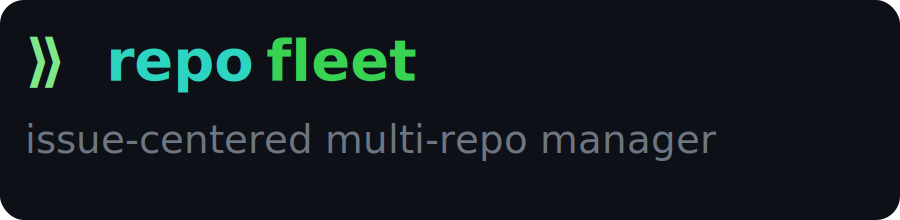

<p align="center">
  <a href="https://github.com/mehranzand/repofleet/releases/latest">
    
  </a>
  <a href="https://github.com/mehranzand/repofleet/actions/workflows/release.yml">
    
  </a>
  <a href="https://github.com/mehranzand/repofleet/blob/main/LICENSE">
    
  </a>
  <a href="https://github.com/mehranzand/homebrew-tap">
    
  </a>
  <a href="https://github.com/mehranzand/scoop-bucket">
    
  </a>
</p>

RepoFleet is an issue-centered CLI tool for managing Git workflows across multiple repositories.

When a feature spans multiple services, RepoFleet  lets you create one issue context, branch all repos together, run git commands across them in parallel, and track every open MR/PR — without switching directories.

---

## Commands

```
repofleet
├── repo
│   ├── add <path>                 Add a repository to a workspace
│   ├── remove <name>              Remove a repository from a workspace
│   └── list                       List repositories in the current workspace
├── git [git args...]              Run any git command across all workspace repos
└── issue
    ├── create <id>                Create an issue context across selected repos
    ├── list                       List all issue contexts
    ├── switch <id>                Switch all repos to the issue branch
    ├── sync                       Fetch and rebase all repos for the current issue
    ├── push                       Push all issue branches to their remotes
    ├── status                     Show status dashboard for the current issue
    └── archive <id>               Archive a completed issue context
```

---

## Installation

### Homebrew (macOS/Linux)

```bash
brew install mehranzand/tap/repofleet
```

### Scoop (Windows)

```powershell
scoop bucket add mehranzand https://github.com/mehranzand/scoop-bucket
scoop install repofleet
```

### From source

Requires Go 1.22+.

```bash
git clone https://github.com/mehranzand/repofleet
cd repofleet
go build -ldflags="-X main.version=dev" -o repofleet ./cmd/repofleet
```

---

## Getting Started

Add repos to a workspace, then create an issue context to work across all of them:

```bash
repofleet repo add ~/code/service-a
repofleet repo add ~/code/service-b

repofleet issue create JIRA-123
repofleet issue status
```

See [CONTRIBUTING.md](CONTRIBUTING.md) for architecture details and how to contribute.